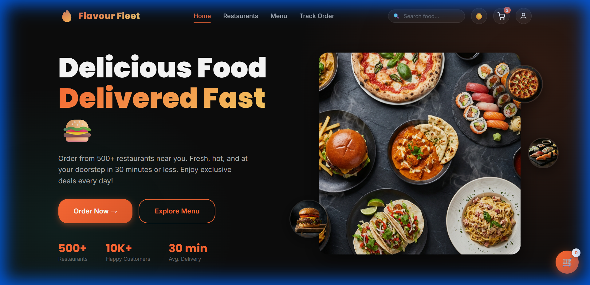
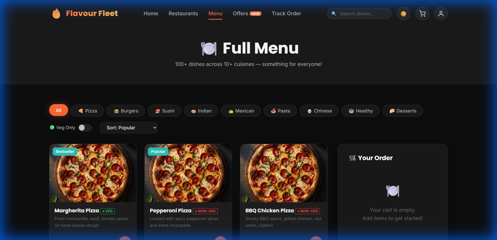
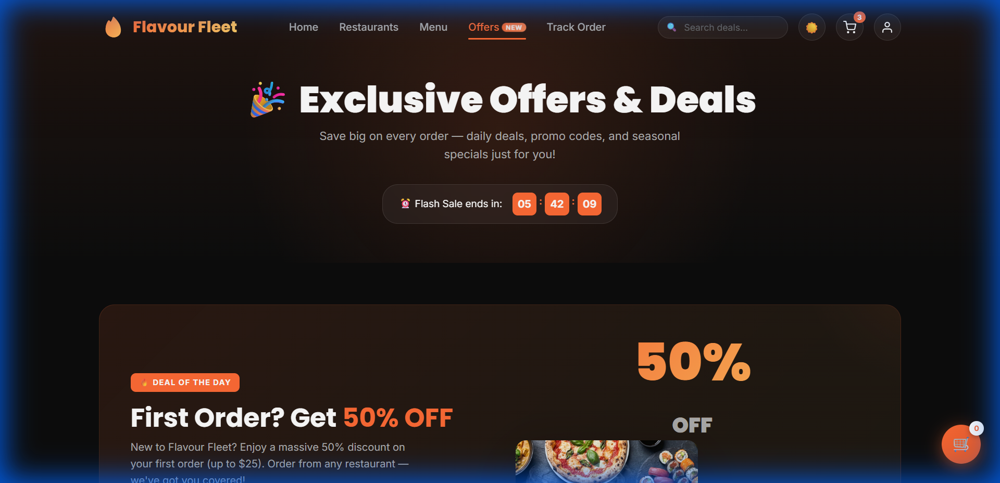
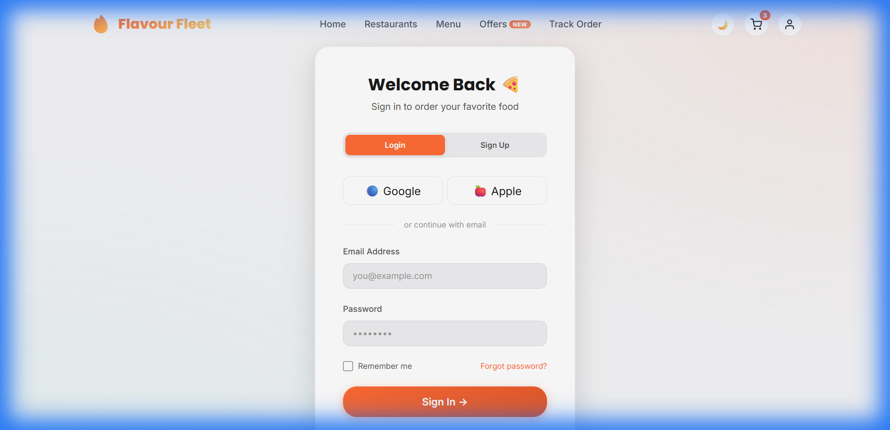
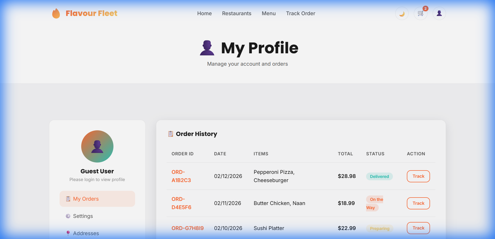

# 🍔 Flavour Fleet — Premium Food Delivery Platform



A full-stack, responsive food delivery web application with intuitive UI, secure authentication, cart management, order tracking, and a modern design system. Built to showcase professional frontend & backend architecture with production-grade features.

**GitHub:** <https://github.com/atul87/Flavour-Fleet-Premium-Food-Delivery-Platform>

---

## 📌 Table of Contents

- [🍔 Flavour Fleet — Premium Food Delivery Platform](#-flavour-fleet--premium-food-delivery-platform)
  - [📌 Table of Contents](#-table-of-contents)
  - [🚀 About the Project](#-about-the-project)
  - [💡 Key Features](#-key-features)
  - [🧠 Tech Stack](#-tech-stack)
  - [📁 Project Structure](#-project-structure)
  - [⚙️ Local Setup \& Installation](#️-local-setup--installation)
    - [📥 Clone](#-clone)
    - [🧰 Backend Setup](#-backend-setup)
    - [🌐 Frontend](#-frontend)
  - [📊 Usage](#-usage)
  - [🛠 Architecture \& Design](#-architecture--design)
  - [📸 Screenshots](#-screenshots)
  - [📈 Roadmap](#-roadmap)
  - [🤝 Contributing](#-contributing)
  - [📄 License](#-license)

---

## 🚀 About the Project

Flavour Fleet is a premium-quality food delivery platform designed to simulate real-world applications with professional architecture and UX. It includes a REST API backend, client-side state management, authentication flows, responsive design, and performance optimizations.

This project was built with the goal of demonstrating full-stack engineering skills and applying frontend + backend best practices.

---

## 💡 Key Features

✔ **User Authentication**: Login, signup, password reset with strength indicator  
✔ **Secure Backend**: Python Flask with session handling and bcrypt hashing  
✔ **Smart Catalogue**: Browsing with composable filters (Veg/Non-Veg + Category + Search)  
✔ **Real-time Cart**: Instant sync, local storage persistence, and promo code system  
✔ **Checkout Flow**: Form validation, order summary, and success animation  
✔ **Order Tracking**: Visual timeline for order status updates  
✔ **Performance**: Lazy loading images, skeleton loaders, and optimized assets  
✔ **Responsive Design**: Mobile-first approach supporting devices <375px to desktop  

---

## 🧠 Tech Stack

**Frontend:**  
✔ HTML5, CSS3 (Custom Design System), Vanilla JavaScript  
✔ Glassmorphism UI, CSS Animations, Responsive Layouts

**Backend:**  
✔ Python Flask REST API  
✔ PyMongo for MongoDB interaction

**Database:**  
✔ MongoDB (Local/Atlas)

**Dev Tools:**  
✔ Git, VS Code  
✔ Flask-CORS, Dotenv

---

## 📁 Project Structure

```bash
Website/
├── backend/
│   ├── app.py              # Main Flask Application
│   ├── seed_data.py        # Database Seeder
│   └── requirements.txt    # Python Dependencies
├── js/
│   ├── api.js              # API Client Wrapper
│   ├── auth.js             # Authentication Logic
│   ├── cart.js             # Cart Management
│   └── main.js             # Core UI Interactions
├── css/
│   ├── style.css           # Main Design System
│   └── animations.css      # Keyframe Animations
├── assets/
│   ├── images/             # Food Assets
│   └── screenshots/        # Project Screenshots
└── index.html              # Entry Point
```

---

## ⚙️ Local Setup & Installation

### 📥 Clone

```bash
git clone https://github.com/atul87/Flavour-Fleet-Premium-Food-Delivery-Platform.git
cd Flavour-Fleet-Premium-Food-Delivery-Platform
```

### 🧰 Backend Setup

1. **Install Dependencies**

```bash
cd backend
pip install -r requirements.txt
```

1. **Seed the Database** (Populates menu, restaurants, offers)

```bash
python seed_data.py
```

1. **Start the Server**

```bash
python app.py
```

> The server will start at `http://localhost:5000`

### 🌐 Frontend

Open `http://localhost:5000` in your browser.

---

## 📊 Usage

1. **Sign Up/Login**: Create an account to access profile and ordering features.
2. **Browse & Filter**: Use the "Veg Only" toggle or category pills to find your favorite dishes.
3. **Add to Cart**: Select items, adjust quantities, and view your cart summary.
4. **Checkout**: Enter delivery details and place your order.
5. **Track Order**: Watch the real-time status updates on the tracking page.

---

## 🛠 Architecture & Design

This project adheres to clear separation of concerns:

- **Modular Backend**: API endpoints organized by resource (Auth, Menu, Cart, Orders).
- **Frontend Logic**: Split by domain responsibility (`auth.js` for user session, `cart.js` for state).
- **Design System**: Centralized CSS variables for colors, typography, and spacing to ensure consistency.

---

## 📸 Screenshots

| **Menu & Filtering** | **Offers & Promos** |
|:---:|:---:|
|  |  |

| **Secure Login** | **User Profile** |
|:---:|:---:|
|  |  |

---

## 📈 Roadmap

- [x] User Authentication
- [x] Composable Filters
- [x] Real-time Cart
- [ ] Payment Gateway Integration (Stripe/Razorpay)
- [ ] Admin Dashboard
- [ ] WebSocket Live Tracking

---

## 🤝 Contributing

Contributions are welcome! Please fork the repository and submit a pull request.
Follow code style guidelines and include tests for any new features.

---

## 📄 License

MIT License © 2026 Atul
