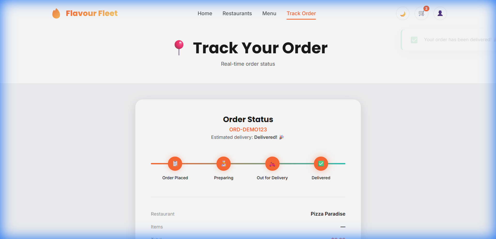

# 🔥 Flavour Fleet — Premium Food Delivery Platform


> **A modern, full-stack food delivery application built with Flask, MongoDB, and Vanilla JS.**  
> Features a beautiful glassmorphic UI, real-time cart management, secure authentication, and a robust REST API.

---

## ✨ Key Features

### 🖥️ Frontend Experience

- **10 Interactive Pages**: Home, Menu, Restaurants, Offers, Cart, Checkout, Login, Profile, Evolution & Tracking.
- **Advanced Filtering**: Composable filters (Veg Only + Category + Search) work seamlessly together.
- **Real-time Cart**: Instant updates, badge sync, local storage persistence, and promo code validation.
- **Secure Authentication**: Login/Signup with **password strength indicator**, session management, and visual feedback.
- **User Profile**: Order history, avatar upload (with validation), and profile management.
- **Smart UX**: Lazy loading images, skeleton loaders, toast notifications, and empty states.
- **Responsive Design**: Fully optimized for mobile (<375px), tablet, and desktop with a custom CSS design system.

### ⚙️ Backend Power

- **REST API**: 20+ endpoints for Auth, Menu, Cart, Orders, and Offers.
- **Database**: MongoDB with optimized indexing for fast queries.
- **Security**: bcrypt password hashing, input validation, and secure session handling.
- **Order Management**: Complete flow from placement to tracking with status updates.

---

## 🎨 Screenshots Gallery

| **Menu & Filtering** | **Offers & Promos** |
|:---:|:---:|
|  |  |
| *Browse 100+ dishes with advanced filtering* | *Exclusive deals with countdown timers* |

| **Secure Login** | **User Profile** |
|:---:|:---:|
|  |  |
| *Authentication with password strength meter* | *Manage profile and view order history* |

| **Order Tracking** | **Real-time Updates** |
|:---:|:---:|
|  | *Live timeline status updates* |

---

## 🛠️ Tech Stack

- **Frontend**: HTML5, CSS3 (Custom Design System), JavaScript (ES6+)
- **Backend**: Python 3.8+, Flask, Flask-CORS
- **Database**: MongoDB (PyMongo)
- **Authentication**: JWT / Session-based with bcrypt
- **Tools**: Git, VS Code

---

## 🚀 Getting Started

### Prerequisites

- Python 3.8 or higher
- MongoDB installed and running locally on port `27017`

### Installation

1. **Clone the repository**

    ```bash
    git clone https://github.com/yourusername/flavour-fleet.git
    cd flavour-fleet
    ```

2. **Set up the Backend**

    ```bash
    cd backend
    pip install -r requirements.txt
    ```

3. **Seed the Database** (Populates menu, restaurants, offers)

    ```bash
    python seed_data.py
    ```

4. **Run the Application**

    ```bash
    python app.py
    ```

    The server will start at `http://localhost:5000`.

---

## � Project Structure

```
Website/
├── assets/             # Images, uploads, and screenshots
├── backend/            # Flask server, models, and seed scripts
├── css/                # Custom CSS design system & animations
├── js/                 # Frontend logic (Auth, Cart, API, Main)
├── index.html          # Homepage
├── menu.html           # Menu with filters
├── ...                 # Other HTML pages
└── README.md           # Project documentation
```

---

## � Future Roadmap

- [ ] **Payment Gateway**: Integration with Stripe/Razorpay.
- [ ] **Admin Dashboard**: For managing menu items and orders.
- [ ] **Live Order Tracking**: WebSocket integration for real-time updates.
- [ ] **PWA Support**: Offline capabilities and installability.

---

## 📄 License

This project is licensed under the MIT License - see the [LICENSE](LICENSE) file for details.

---

**Built with ❤️ by Atul**
