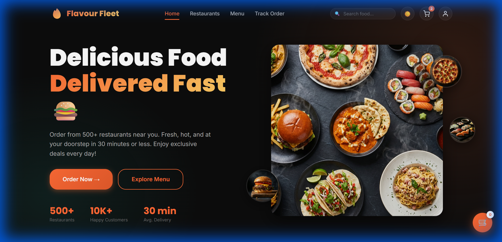
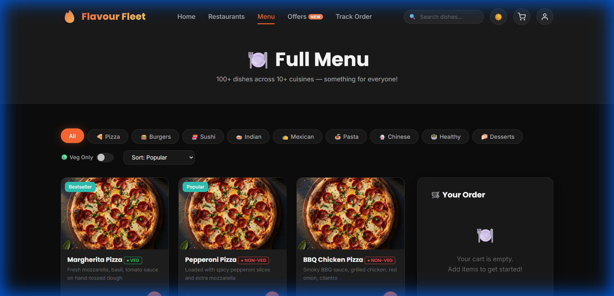
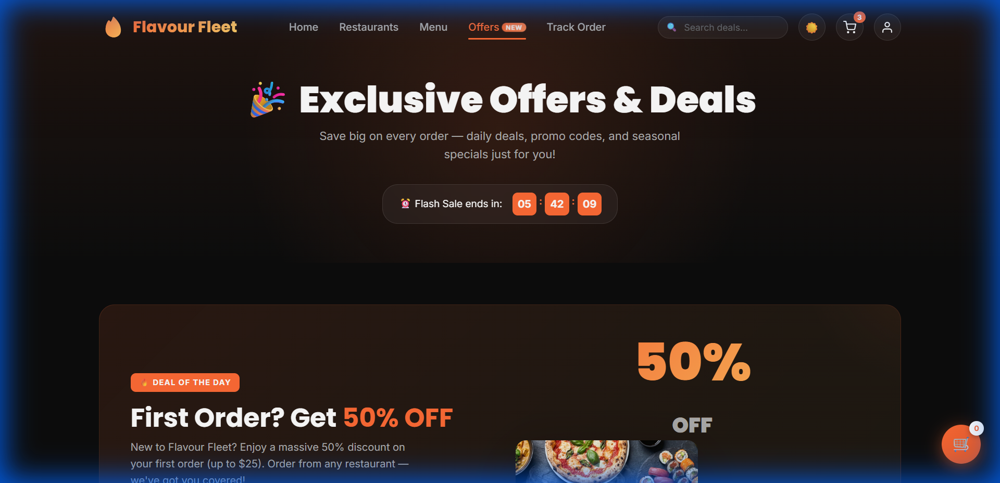
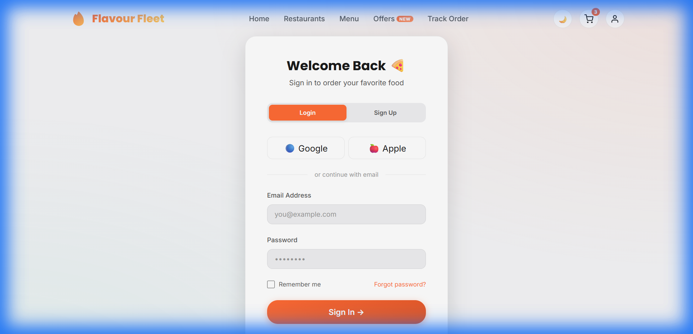
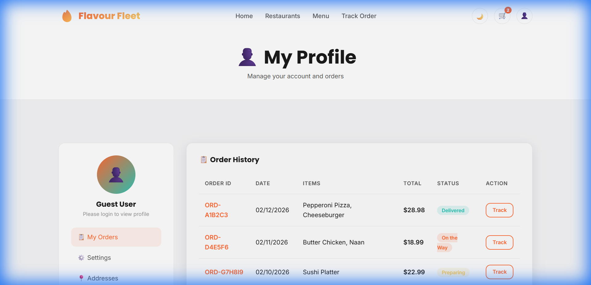

# 🍔 Flavour Fleet — Premium Food Delivery Platform



A full-stack, production-grade food delivery web application featuring real-time order tracking, secure authentication, admin dashboard, smart catalogue, and a modern design system — built with Flask, MongoDB, and Socket.IO.

**GitHub:** <https://github.com/atul87/Flavour-Fleet-Premium-Food-Delivery-Platform>

---

## 📌 Table of Contents

- [About the Project](#-about-the-project)
- [Key Features](#-key-features)
- [Tech Stack](#-tech-stack)
- [Project Structure](#-project-structure)
- [Local Setup & Installation](#️-local-setup--installation)
- [API Endpoints](#-api-endpoints)
- [Usage](#-usage)
- [Architecture & Design](#-architecture--design)
- [Screenshots](#-screenshots)
- [Roadmap](#-roadmap)
- [Contributing](#-contributing)
- [License](#-license)

---

## 🚀 About the Project

Flavour Fleet is a premium food delivery platform designed as a startup-ready application. It includes a REST API backend with Flask Blueprints, real-time WebSocket tracking via Socket.IO, dynamic frontend rendering, PWA support, admin dashboard, and comprehensive security measures. The architecture follows production best practices with API versioning, rate limiting, and materialized analytics.

---

## 💡 Key Features

### 🔐 Security & Auth

- Login, signup, password reset with strength indicator
- Bcrypt password hashing + Flask session management
- Rate limiting on sensitive endpoints (login, register, forgot-password)
- Server-side promo code re-validation (never trusts client discount)

### 🍕 Core Platform

- **Smart Catalogue**: Composable filters (Veg/Non-Veg + Category + Search)
- **Real-time Cart**: Instant sync, localStorage persistence, promo code system
- **Checkout Flow**: Indian address validation, order summary, payment recording
- **Dynamic Rendering**: Menu, restaurants, & offers loaded from API with skeleton loaders

### 📡 Real-Time

- **Socket.IO Live Tracking**: WebSocket-based order status pushed from admin → tracking page
- **Admin Dashboard**: Full CRUD for menu, restaurants, offers, users, orders
- **Analytics**: Materialized daily snapshots (revenue, top items, top restaurants)

### 📱 Modern UX

- **PWA**: Installable via `manifest.json` + service worker with offline caching
- **Accessibility**: ARIA landmarks, skip-to-content, `aria-live` on dynamic regions
- **SEO**: Open Graph tags, meta descriptions on all key pages
- **Responsive Design**: Mobile-first, 375px to desktop

---

## 🧠 Tech Stack

| Layer | Technologies |
|-------|-------------|
| **Frontend** | HTML5, CSS3 (Custom Design System), Vanilla JS, Font Awesome |
| **Backend** | Python Flask, Flask Blueprints (9 modules), Flask-SocketIO |
| **Database** | MongoDB with 17 compound indexes |
| **Real-Time** | Socket.IO (WebSocket) |
| **Email** | Resend API (order confirmation, password reset) |
| **Security** | Bcrypt, Flask-Limiter, server-side validation |
| **PWA** | manifest.json, Service Worker (cache-first/network-first) |
| **Dev Tools** | Git, VS Code, Flask-CORS, python-dotenv |

---

## 📁 Project Structure

```bash
Website/
├── backend/
│   ├── app.py                     # Entry point (Flask + Socket.IO)
│   ├── db.py                      # MongoDB connection + 17 indexes
│   ├── helpers.py                 # Auth decorators, error handlers, logger
│   ├── routes/
│   │   ├── auth.py                # Login, register, profile, password reset
│   │   ├── menu.py                # Menu items API
│   │   ├── restaurants.py         # Restaurants API
│   │   ├── cart.py                # Cart management
│   │   ├── orders.py              # Order placement + payment recording
│   │   ├── offers.py              # Promo codes & deals
│   │   ├── admin.py               # Admin CRUD + analytics snapshots
│   │   ├── addresses.py           # Delivery address management
│   │   ├── payments.py            # Payment history
│   │   └── realtime.py            # Socket.IO event handlers
│   ├── utils/
│   │   ├── email_service.py       # Resend email integration
│   │   └── email_templates.py     # HTML email templates
│   ├── seed_data.py               # Database seeder
│   ├── requirements.txt           # Python dependencies
│   └── .env                       # Environment variables
├── js/
│   ├── api.js                     # API client wrapper
│   ├── auth.js                    # Authentication logic
│   ├── cart.js                    # Cart state management
│   ├── main.js                    # Core UI interactions
│   └── dynamic-render.js          # Dynamic API → HTML renderer
├── css/
│   ├── style.css                  # Main design system
│   └── animations.css             # Keyframe animations
├── assets/images/                 # Food & UI assets
├── manifest.json                  # PWA manifest
├── sw.js                          # Service worker
├── index.html                     # Landing page
├── menu.html                      # Dynamic menu (API-powered)
├── restaurants.html               # Dynamic restaurants
├── offers.html                    # Dynamic offers & deals
├── login.html                     # Auth with inline validation
├── cart.html                      # Shopping cart
├── checkout.html                  # Checkout flow
├── tracking.html                  # Real-time order tracking
└── admin/                         # Admin dashboard
```

---

## ⚙️ Local Setup & Installation

### 📥 Clone

```bash
git clone https://github.com/atul87/Flavour-Fleet-Premium-Food-Delivery-Platform.git
cd Flavour-Fleet-Premium-Food-Delivery-Platform
```

### 🧰 Backend Setup

1. **Install Dependencies**

```bash
cd backend
pip install -r requirements.txt
```

1. **Configure Environment** — Create `backend/.env`:

```env
SECRET_KEY=your_secret_key_here
RESEND_API_KEY=your_resend_api_key
FROM_EMAIL=onboarding@resend.dev
```

1. **Seed the Database** (Populates menu, restaurants, offers)

```bash
python seed_data.py
```

1. **Start the Server**

```bash
python app.py
```

> The server starts at `http://localhost:5000` with Socket.IO enabled.

### 🌐 Frontend

Open `http://localhost:5000` in your browser — all pages are served by Flask.

---

## � API Endpoints

All endpoints are available at both `/api/` and `/api/v1/` (versioned).

| Method | Endpoint | Description |
|--------|----------|-------------|
| POST | `/api/auth/register` | Create account |
| POST | `/api/auth/login` | Login |
| POST | `/api/auth/forgot-password` | Request password reset |
| GET | `/api/menu` | Get all menu items |
| GET | `/api/restaurants` | Get all restaurants |
| GET | `/api/offers` | Get active offers |
| GET/POST | `/api/cart` | Get/update cart |
| POST | `/api/orders` | Place order |
| GET | `/api/orders` | Get order history |
| GET | `/api/addresses` | Get saved addresses |
| POST | `/api/addresses` | Save new address |
| GET | `/api/payments` | Payment history |
| GET | `/api/health` | Health check (v4.0.0) |
| GET | `/api/admin/stats` | Admin dashboard stats |
| POST | `/api/admin/analytics/snapshot` | Build analytics snapshot |

---

## 📊 Usage

## CI/CD and Vercel deployment

This repository includes a GitHub Actions workflow that runs backend tests and deploys to Vercel on pushes to `main`:

- Workflow: `.github/workflows/ci-cd.yml`

Required GitHub Secrets (set in your repository Settings → Secrets):

- `VERCEL_TOKEN` — your Vercel personal token (create at <https://vercel.com/account/tokens>)
- `VERCEL_ORG_ID` — Vercel organization ID for the project
- `VERCEL_PROJECT_ID` — Vercel project ID for the repo
- `SUPABASE_URL` — your Supabase project URL
- `SUPABASE_SERVICE_KEY` — Supabase service role key (server-side)
- `SECRET_KEY` — Flask `SECRET_KEY` for sessions

How it works:

1. Push to `main` triggers the workflow.
2. The job installs Python deps from `backend/requirements.txt` and runs `pytest` (if tests exist).
3. If tests pass, the workflow runs the Vercel deploy action to publish to your Vercel project.

Notes:

- Vercel is ideal for hosting the static frontend (`index.html`, `css/`, `js/`). If you prefer the Flask backend to run on a hosted server, deploy the backend to a platform such as Render, Fly, or Docker hosting, and set the backend URL in the frontend config.
- You must connect this GitHub repository to a Vercel project (<https://vercel.com/new>) or provide `VERCEL_ORG_ID` and `VERCEL_PROJECT_ID` for the GitHub Action to deploy automatically.

1. **Sign Up/Login**: Create an account or use demo credentials.
2. **Browse & Filter**: Use category pills, search, or Veg/Non-Veg toggle.
3. **Add to Cart**: Select items, adjust quantities, apply promo codes.
4. **Checkout**: Enter delivery details and place your order.
5. **Track Order**: Watch real-time status updates via Socket.IO.
6. **Admin Panel**: Access at `/admin/` to manage menu, orders, analytics.

---

## 🛠 Architecture & Design

```
┌────────────┐     ┌──────────────────┐     ┌──────────┐
│  Frontend   │────▶│  Flask + SocketIO │────▶│  MongoDB  │
│  (HTML/JS)  │◀────│  9 Blueprints     │◀────│  17 idx   │
└────────────┘     └──────────────────┘     └──────────┘
       │                     │
       ▼                     ▼
  Service Worker        Resend Email
  (Offline Cache)      (Confirmations)
```

- **Modular Backend**: 9 Flask Blueprints with clear separation of concerns
- **API Versioning**: All routes available at `/api/` and `/api/v1/`
- **Real-Time**: Socket.IO rooms for per-order live tracking
- **Security**: Rate limiting, bcrypt, server-side validation, soft deletes
- **Frontend**: Dynamic API rendering with skeleton loading states
- **Design System**: CSS variables for colors, typography, spacing

---

## 📸 Screenshots

| **Menu & Filtering** | **Offers & Promos** |
|:---:|:---:|
|  |  |

| **Secure Login** | **User Profile** |
|:---:|:---:|
|  |  |

---

## 📈 Roadmap

- [x] User Authentication & Sessions
- [x] Composable Filters & Smart Search
- [x] Real-time Cart with Promo Codes
- [x] Admin Dashboard (full CRUD)
- [x] Security: Rate limiting, bcrypt, validation
- [x] Blueprint Architecture (9 modules)
- [x] Dynamic API Rendering (menu, restaurants, offers)
- [x] WebSocket Live Tracking (Socket.IO)
- [x] PWA Support (manifest + service worker)
- [x] Accessibility (ARIA, skip-to-content)
- [x] API Versioning (`/api/v1/`)
- [x] Payment & Address Management
- [x] Materialized Analytics Snapshots
- [x] Resend Email (order confirmation, password reset)

---

## 🤝 Contributing

Contributions are welcome! Please fork the repository and submit a pull request.
Follow code style guidelines and include tests for any new features.

---

## 📄 License

This project is **100% Free and Open Source**.

Anyone and everyone is completely free to download, use, modify, publish, and perform any operation on this project. Feel free to use it however you want, for personal, educational, or commercial purposes. No strings attached!

*(Licensed under the MIT License - see the [LICENSE](LICENSE) file for exact legal details, but essentially: do whatever you want).*
